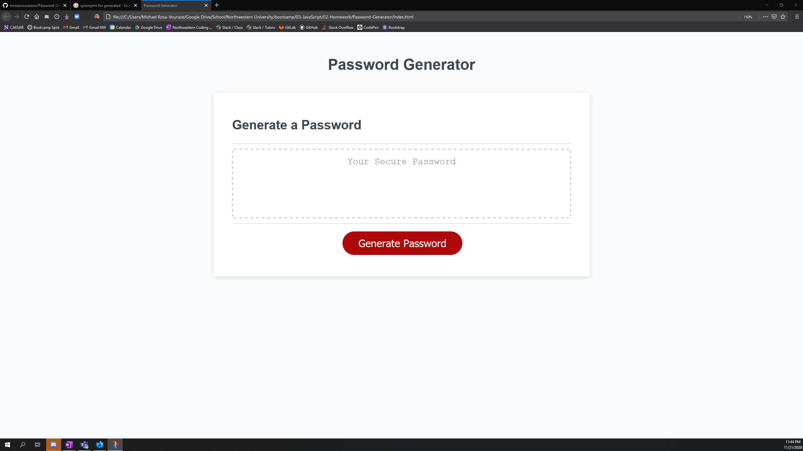
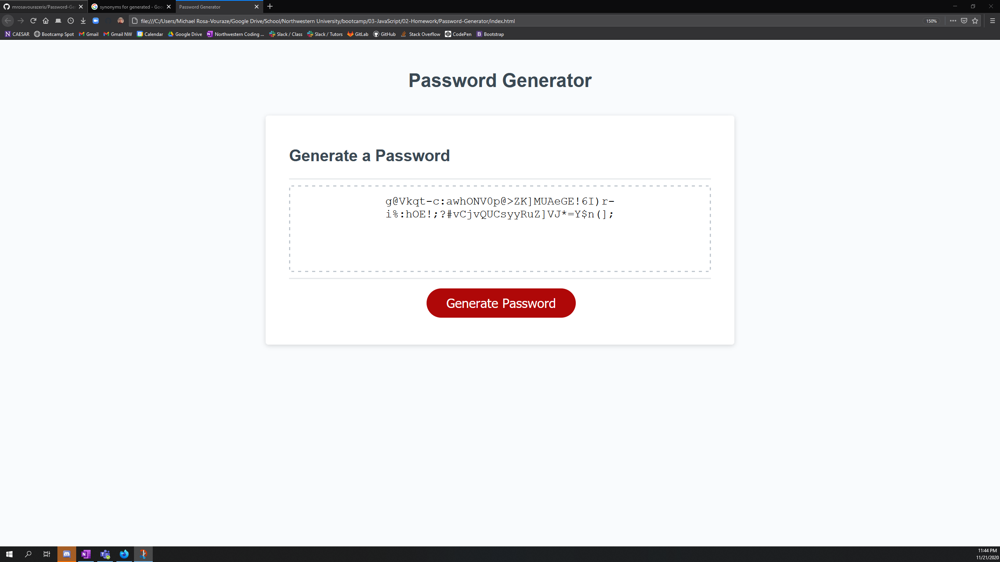

# Password-Generator

## Description

This repository contains my completed code for week 3's homework. In this week's homework, we were to create a password generator that could generate different and random passwords based off the user selecting certain criteria. 

## Notes

As of right now, the code runs, and I am able to get a password generated and entered into the text box once complete. There are still more things I would like to clean up and will do so in the next couple of days.

## Screen Shot of Completed Work

## Link to Deployed Application

https://mrosavourazeris.github.io/Password-Generator/

